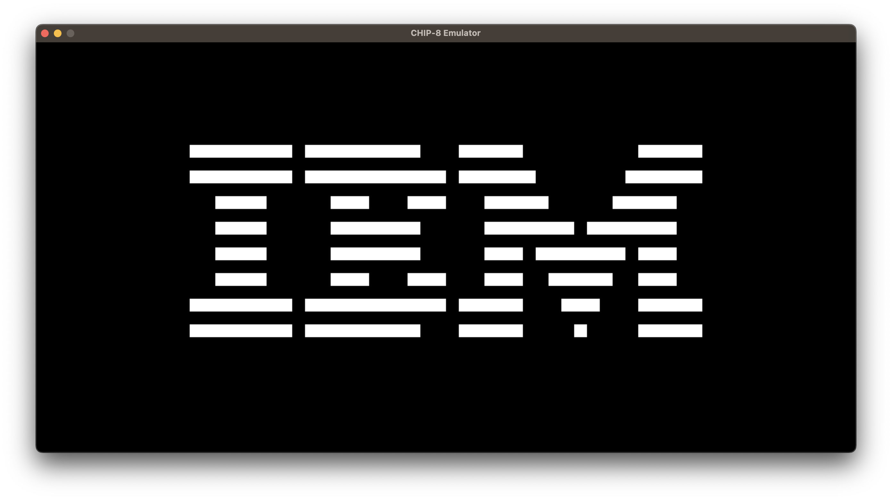

# c8

A small CHIP-8 emulator written in C99.

## Building

Make sure you have SDL2 headers and libraries installed.
Then, simply run `make`.

## Installing

Run `sudo make install` to install c8 to `/usr/local/bin`.
To specify a custom install path, set the DESTDIR variable when running make: `sudo make install DESTDIR=/path/to/install`

## Usage

`c8 /path/to/rom`

The keypad is mapped as follows:
```
1 | 2 | 3 | 4
Q | W | E | R
A | S | D | F
Z | X | C | V
```

### Function keys
 - `ESC` - Quit
 - `F2` - Pause/Continue
 - `F5` - Reload ROM
 - `[` - Volume -
 - `]` - Volume +

## Screenshots

##### IBM Logo


##### Breakout


##### Tetris

